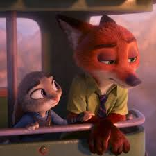

**The Weight of Memory**

No matter how many times you try to forget, it still comes down as a memory, sometimes gently, like a feather drifting back into your hands, 
and other times like a storm crashing through the quiet. We try to move on, to let go of the people and moments that once meant everything. 
We convince ourselves it’s over, that we’ve healed, that we’ve erased the trace they left behind. But memory doesn’t work that way. 

A friend mentioned something just a passing comment not knowing what it would stir in me. But in that single moment, 
without even meaning to, it took me back. Back to a time I thought I’d let go of, back to a smile I hadn’t seen in years, 
a voice I’d trained myself to forget. And there it was again, that old memory, rising up like it had just happened yesterday. 
Funny how that works. You think you're fine, and then one small thing opens the floodgates.

When someone mattered to you deeply, when they were a part of your every day, your thoughts, your plans, forgetting isn’t just hard, it’s almost impossible. 
You’ll find them in the songs you used to share, in a certain laugh that sounds just like theirs, or in a quiet moment that mirrors the ones you once held close. 
It’s not that you want to remember, but your mind does it for you, pulling fragments of them from the corners you thought you’d sealed off.

There’s a kind of ache that comes from trying to forget someone who still lingers in your memories. You rewrite the story, close the book, even put it back on the shelf, 
but somehow, the pages find you. Maybe that’s part of what it means to care, to have loved fully enough that forgetting isn’t just erasing, 
it’s like tearing out a piece of yourself.

Still, even if we can’t forget, we learn to carry it differently. Some memories fade into softer shades over time, and others stay sharp. 
But through it all, they become part of the mosaic that makes us who we are, reminders of love, of lessons, and of how far we’ve come.

